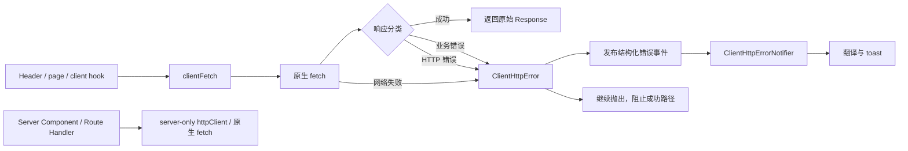

# web-h5 客户端请求错误反馈改造计划

## 目标

建立一个只用于浏览器的统一请求入口，使客户端 `fetch` 请求在以下失败场景自动给用户反馈，同时不让业务方法直接依赖 `toast`：

- 顶层业务码存在且不等于 `200` / `'200'`：优先显示后端的 `message`、`msg` 或字符串 `error`。
- 不存在业务码且 HTTP 状态非 2xx：有响应说明时显示说明，没有响应说明时按 HTTP 状态码显示本地化提示。
- 请求未取得响应：显示网络连接失败提示。
- 主动取消的 `AbortError`：默认不提示。

本次不覆盖或改写原生 `globalThis.fetch`，也不改变 Server Component、Route Handler 和服务端 `httpClient` 的行为。

## 已确认现状

- `apps/web-h5/lib/http.ts` 是明确的 `server-only` 请求适配器，继续只供服务端使用。
- `apps/web-h5/lib/http-fetch.ts` 依赖 `'use server'` 的 `translateError`，属于客户端请求与服务端翻译混合的旧入口，不作为新客户端基础设施继续扩展。
- `apps/web-h5/app/[locale]/layout.tsx` 已经挂载 `<Sonner />`，可以在同一 `NextIntlClientProvider` 内挂载全局反馈监听器。
- `go-now.ts` 中的请求是合适的首个试点：目前业务码失败会静默返回，网络失败也没有一致反馈。
- 工作树已有用户改动：`apps/web-h5/app/error.tsx` 和未跟踪的 `apps/web-h5/lib/run-user-action.ts`。实施时不得覆盖或删除。

## 目标架构



### 职责边界

| 模块 | 职责 | 禁止事项 |
| --- | --- | --- |
| `lib/client-http/client-fetch.ts` | 调用浏览器 `fetch`、保留原始 `Response`、触发错误分类 | 不导入 `toast`、Next Server API 或 Server Action |
| `lib/client-http/classify-response.ts` | 纯函数解析业务码、消息和 HTTP 状态 | 不访问 `window`、React、翻译服务 |
| `lib/client-http/error-events.ts` | 发布/订阅安全的结构化客户端错误 | 不传完整响应体、token 或敏感请求头 |
| `app/components/client-http-error-notifier.tsx` | 监听事件、按 locale 翻译并显示 `toast` | 不发起业务请求、不决定业务是否成功 |
| `lib/http.ts` | 服务端请求 | 不导入客户端反馈模块 |
| 业务页面/方法 | 调用 `clientFetch` 并处理成功数据 | 不重复弹同一个请求错误 |

## 错误判定契约

按以下顺序判定，命中后停止继续判断：

| 优先级 | 条件 | 用户消息 | 是否抛错 |
| --- | --- | --- | --- |
| 1 | 原生 `fetch` reject | 本地化网络错误 | 是 |
| 2 | JSON 顶层存在 `code`，且标准化后不是 `200` | `message` > `msg` > 字符串 `error` > 业务码兜底 | 是 |
| 3 | HTTP 非 2xx | 响应消息 > 非空文本响应 > HTTP 状态映射 | 是 |
| 4 | HTTP 2xx，业务码缺失或为 `200` | 不提示，返回原始响应 | 否 |
| 特例 | `AbortError` | 默认静默 | 原样抛出 |

约束：

- 只识别顶层 `code`，避免误把 `data.code` 等业务数据当成响应码。
- `200` 和 `'200'` 均视为成功；`0`、空字符串和其他字符串均视为明确的非 200 业务码。
- 仅在 JSON 响应中检查业务码；成功的文件、流和纯文本响应不读取副本。
- 解析使用 `response.clone()`，调用方仍能正常消费原始 body。
- 默认 `feedback: 'auto'`；轮询、预取、输入联想和后台刷新显式使用 `feedback: 'silent'`。
- 错误发布后仍抛出 `ClientHttpError`，防止失败响应继续进入成功逻辑。

## 实施阶段

### 阶段 0：建立行为基线

1. 保存当前工作树状态，只观察、不改动 `error.tsx` 和 `run-user-action.ts`。
2. 记录首批试点 `go-now.ts` 的成功行为：请求地址、鉴权头、PMS 回调地址、HR 新窗口地址。
3. 添加纯分类器测试，先覆盖成功、业务失败、HTTP 空响应、网络失败和取消请求。

验收门：新增测试先能证明旧代码没有统一分类能力，再进入实现。

### 阶段 1：新增客户端请求基础设施

计划新增：

- `apps/web-h5/lib/client-http/classify-response.ts`
- `apps/web-h5/lib/client-http/client-http-error.ts`
- `apps/web-h5/lib/client-http/error-events.ts`
- `apps/web-h5/lib/client-http/client-fetch.ts`
- 对应的 `*.test.ts`

实现要求：

1. 新入口保持与原生 `fetch(input, init)` 接近，第三个参数仅承载 `feedback` 等应用策略。
2. 业务失败、HTTP 失败和网络失败统一构造 `ClientHttpError`。
3. 错误事件只携带 `kind`、安全消息、HTTP 状态、业务码和请求标识，不携带 payload。
4. 同一请求只发布一次错误事件。

### 阶段 2：挂载全局反馈组件

1. 新增 `apps/web-h5/app/components/client-http-error-notifier.tsx`，声明 `'use client'`。
2. 在 `NextIntlClientProvider` 内、现有 `<Sonner />` 附近挂载一次。
3. HTTP 状态使用本地翻译 key；业务消息先立即显示原文，再异步更新同一个 toast 为翻译结果，翻译失败保留原文。
4. 翻译调用继续走现有 Server Action，但不得通过 `clientFetch` 调用，避免错误递归。
5. 同一个 `ClientHttpError` 如果已自动提示，调用方迁移时不得再次提示。

### 阶段 3：以 go-now 链路作为试点

1. 将 `requestPlatformCode` 的原生 `fetch` 替换为 `clientFetch`。
2. 保持成功分支、请求头、URL、PMS/HR 打开方式和租户选择逻辑不变。
3. 业务码非 200、HTTP 非 2xx、空响应和网络失败改为自动提示并中断成功路径。
4. `NEXT_PUBLIC_HR_TRIAL_HOST` 缺失发生在请求成功之后，不属于 fetch 错误；第一阶段保留现有 `onHrTrialHostMissing` 行为，不能误宣称全局请求层已覆盖。
5. `Header.tsx` 和账户选择页移除的只能是已经由新层覆盖的重复请求错误提示；配置缺失提示暂不移除。

试点验收后再进入批量迁移，避免一次性改动所有客户端请求。

### 阶段 4：分批迁移客户端请求

按风险从低到高迁移，每批都单独验证：

1. 简单用户操作：促销码、反馈投票/评论、设置保存。
2. 账户操作：登录、注册、忘记密码、联系表单；迁移后逐步退出旧 `http-fetch.ts` 的客户端消费。
3. 订单和支付：新增服务、升级、续费、取消、付款凭证；保留现有 loading/success toast，只删除重复的 error toast。
4. 后台读取：租户缓存、动态翻译、搜索和预取，默认标记 `feedback: 'silent'`，继续使用页面内空态或重试 UI。
5. Server Component、Route Handler、服务端翻译和 Better Stack 上报保持原入口，不迁移。

每迁移一个调用点，必须明确标注为以下类别之一：

- `interactive`：默认自动错误提示。
- `background`：静默，使用页面状态反馈。
- `server`：不使用客户端入口。
- `special`：流式、文件上传/下载或第三方协议，单独评估。

### 阶段 5：清理与收口

1. 搜索客户端依赖图中剩余的原生 `fetch`，确认它们都是有意保留。
2. 搜索业务码判断和请求错误 toast，删除已经被统一层覆盖的重复逻辑。
3. 评估旧 `lib/http-fetch.ts` 是否仅剩服务端/Server Action 消费，再决定保留、重命名或废弃。
4. `lib/run-user-action.ts` 属于现有未提交用户文件；除非用户明确决定废弃，否则不删除。它仍可用于需要 loading/success 文案的复杂操作。
5. 更新客户端请求使用说明，明确禁止覆盖原生 fetch。

## 验证矩阵

### 自动测试

- HTTP 200 + `{ code: 200 }`：成功且原始响应仍可读取。
- HTTP 200 + `{ code: '200' }`：成功。
- HTTP 200 + `{ code: 500, message: '业务说明' }`：发布一次业务错误并抛错。
- HTTP 200 + `{ code: 'CONTENT_REJECTED', message: '内容说明' }`：发布业务错误。
- HTTP 400/500 + JSON `message`：优先使用响应消息。
- HTTP 400/500 + 空 body：使用状态码映射。
- HTTP 502 + 非空文本：使用安全文本提示。
- 网络 reject：发布网络错误。
- `AbortError`：不发布 toast 事件。
- `feedback: 'silent'`：仍抛错，但不发布事件。
- JSON 中只有 `data.code`：不作为顶层业务码处理。
- notifier 收到同一请求事件：只创建/更新一个 toast。

### go-now 回归

- PMS 租户进入、PMS 免费试用、HR 租户进入成功路径不变。
- 鉴权头和 URL 不变。
- HR host 缺失仍有原提示。
- 业务失败、HTTP 失败和断网新增明确反馈，不打开窗口。

### 工程验证

```bash
pnpm --filter web-h5 exec tsx --test app/lib/go-now.test.ts lib/client-http/*.test.ts
pnpm --filter web-h5 type-check
pnpm --filter web-h5 lint
pnpm --filter web-h5 build
```

只对本次修改文件运行 Oxfmt；不格式化整个仓库。

### 手工验证

- 浏览器模拟 Offline。
- 模拟 HTTP 401、403、404、429、500、502、503、504 空响应。
- 模拟 HTTP 200 + 非 200 业务码及业务说明。
- 快速重复点击，确认无重复 toast、成功路径不会执行。
- 页面切换触发 abort，确认不出现错误 toast。
- 中文简体、中文繁体、英文下检查状态提示和业务消息翻译降级。

## 主要风险与缓解措施

| 等级 | 风险 | 影响 | 缓解措施 |
| --- | --- | --- | --- |
| 高 | 不同接口的 `code` 契约并不统一 | 合法响应可能被误判失败 | 第一阶段只接 go-now；仅检查顶层 code；记录例外并允许按请求关闭业务码检查 |
| 高 | 迁移时旧代码和全局监听器同时 toast | 用户看到重复提示 | 按调用点原子迁移；错误带 `notified`/请求 ID；删除的仅是重复 error toast |
| 高 | 自动提示后错误继续抛出，事件处理器没有 await/catch | 控制台出现未处理 Promise，后续流程不可控 | 保留现有 catch；试点为直接调用点补充最小的已知错误终止逻辑，但不在业务方法中加入 toast |
| 高 | 订单/支付流程错误分支复杂 | 删除局部逻辑可能改变支付状态或跳转 | 最后迁移；保留 loading、success 和业务分支，只集中错误展示 |
| 中 | `response.clone()` 检查大 JSON 或流 | 内存/性能增加 | 仅检查 JSON；流、文件和大响应显式关闭 body inspection |
| 中 | 动态翻译是 Server Action | toast 延迟、翻译失败或产生二次请求 | 先显示原文，再使用同一 toast ID 更新；失败保持原文；翻译不走 clientFetch |
| 中 | 后台请求默认自动提示 | 轮询、预取或搜索造成噪声 | 调用点分类审计；后台请求强制 `feedback: 'silent'` |
| 中 | 401 同时需要会话失效处理 | 只有提示但仍停留在无效页面 | 第一阶段只提示以保持逻辑；后续单独设计认证 adapter，不混入本次迁移 |
| 中 | 事件中泄露响应 payload 或后端内部细节 | 敏感信息进入浏览器事件/日志 | 事件白名单字段；不传 payload、token、headers；消息限制长度并按纯文本显示 |
| 中 | notifier 尚未挂载时产生事件 | 错误没有 toast | 客户交互只在 hydration 后发生；测试首屏 effect；必要时为事件总线增加短队列 |
| 低 | `run-user-action.ts` 与新机制职责重叠 | 团队不清楚该用哪个入口 | 文档明确：请求失败由 clientFetch；特定 loading/success 由 runUserAction 或页面控制 |
| 低 | 弹窗打开发生在异步请求之后 | 浏览器可能拦截新窗口 | 记录现状，本计划不改变窗口策略；另行评估预开空白窗口方案 |

## 验收标准

- `go-now.ts` 不导入任何 toast/UI 组件。
- go-now 请求在业务码失败、HTTP 失败和断网时自动显示一次明确错误。
- HTTP 成功且业务码成功时行为与当前一致。
- HR host 缺失提示仍然存在，且没有被错误归类为请求失败。
- 客户端请求模块不导入 `server-only` 模块、`next/headers`、Node API 或 Server Action。
- Server Component 和 Route Handler 的请求行为不变。
- 试点测试、类型检查、lint 和构建通过后，才开始下一批迁移。
- 用户现有的 `error.tsx` 和 `run-user-action.ts` 改动保持不变。

## 回滚策略

每个阶段保持可独立回滚：

1. notifier 和客户端请求模块为新增文件，不影响未迁移请求。
2. go-now 试点只需恢复其请求入口即可回到旧行为。
3. 批量迁移按功能区拆分，任何一批失败只回退该批调用点。
4. 不删除旧请求入口，直到全部消费者和验证结果明确。

## 审批门

计划获批后只实施阶段 0 至阶段 3，先交付 go-now 试点及验证结果。阶段 4 的全量迁移在试点结果确认后单独继续。
